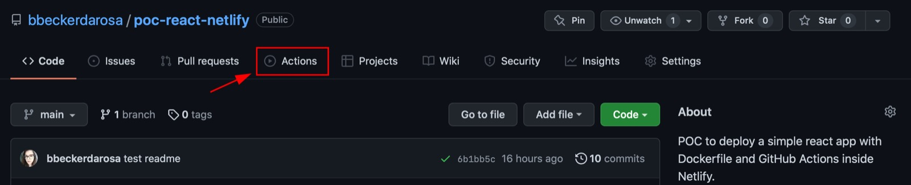
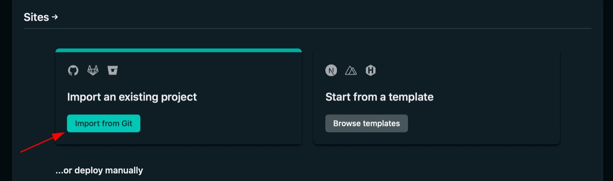
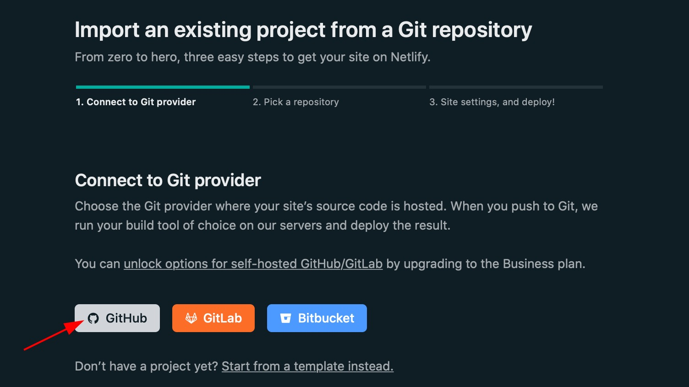
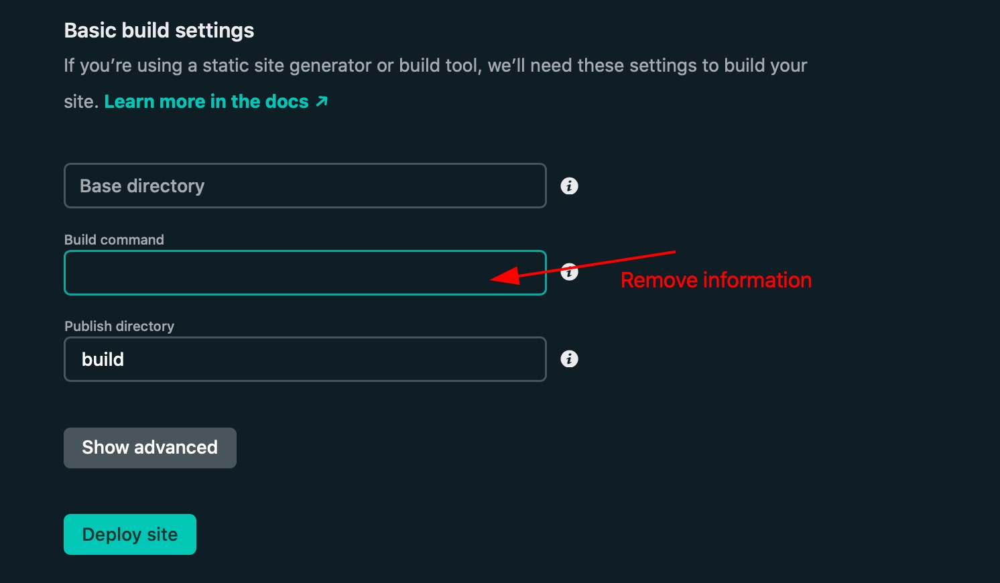
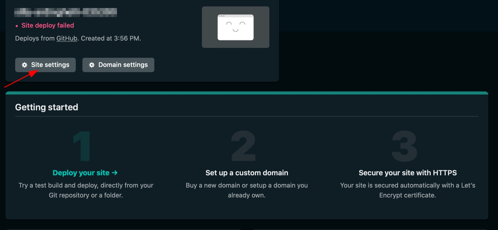
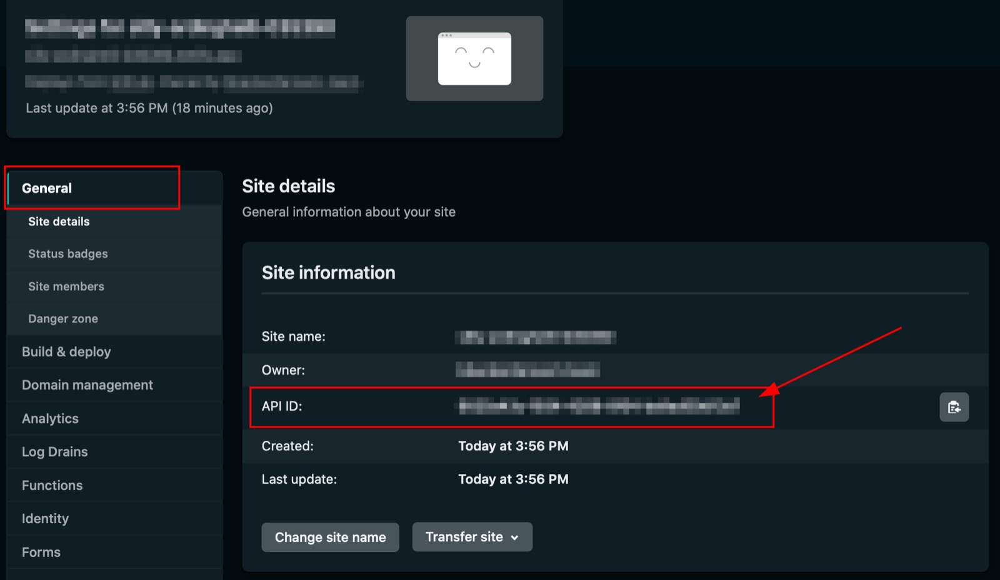
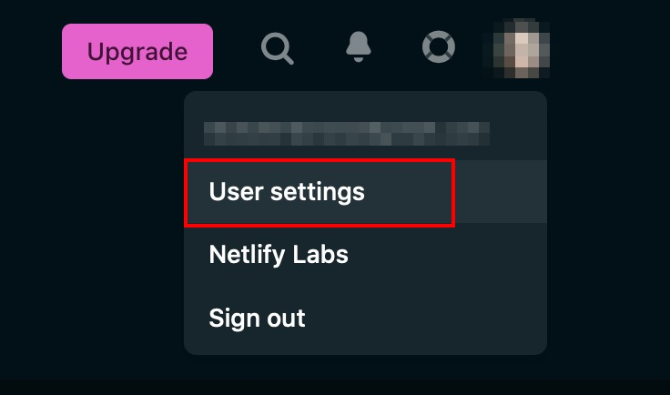
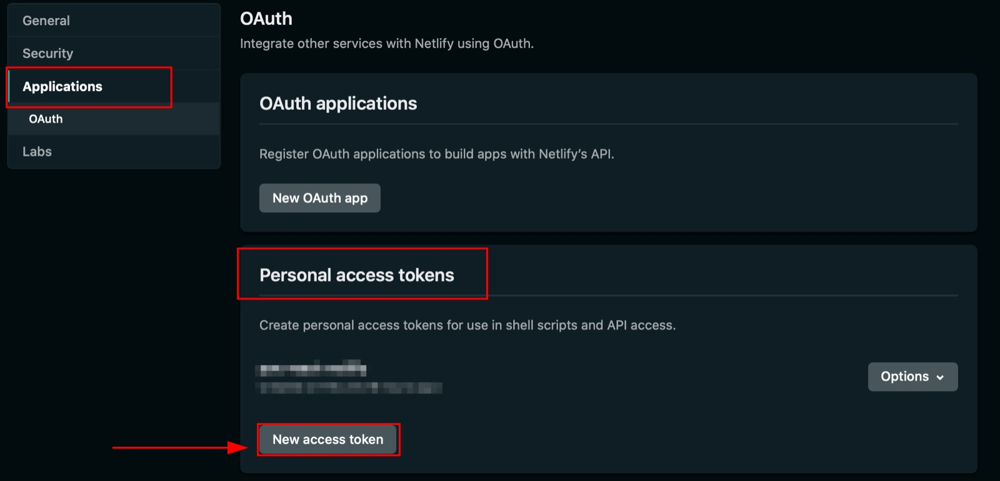
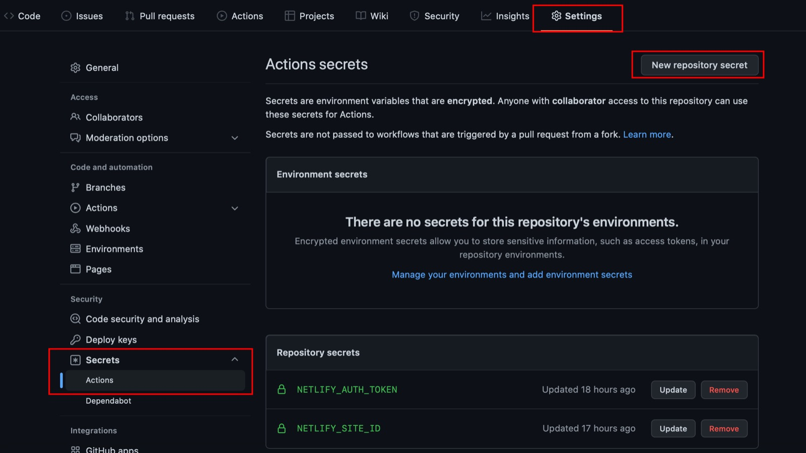

# POC React App
## Getting Started with Create React App

This project was bootstrapped with [Create React App](https://github.com/facebook/create-react-app).

### Run React App Locally

In the project directory, you can run:

```npm start```

Runs the app in the development mode.\
Open [http://localhost:3000](http://localhost:3000) to view it in your browser.

The page will reload when you make changes.\
You may also see any lint errors in the console.

```npm test```

Launches the test runner in the interactive watch mode.\
See the section about [running tests](https://facebook.github.io/create-react-app/docs/running-tests) for more information.

```npm run build```

### Run React App from Dockerfile Locally

In the project directory, to build the application with Docker multistage you can run:

```docker build -t poc-react-netlify .```

```docker run --rm -it -p 3000:80 poc-react-netlify```

After that, you can access the application with this URL in your browser:

```http://localhost:3000```


## Run React App using Github Actions and Deploying into Netlify

To run the project at your Github Account like an POC, you need to do `git clone` from the project and to do `git push` afterwards to your account.

When you push the project at your Github Account, inside the folder of the project, you will see a tab `Actions`:



Inside of the tab `Actions` you will see that the project start the CI building, but since you haven't set the access secrets for Netlify yet, the CI will fail.

You need to log into your Netlify account and create the project there by following the steps below:

- Access your Netlify Account
- In the initial page of your account, you will see this information and you will choose `Import from Git`:

 



- After that you will need to pick a repository and then click in `Deploy site`.



- Once this is done, you will be redirected to the page of the created site and then this screen will appear and you will click on `Site Settings`:



- Under General Information you will find the value of the `API ID` property. Copy the value and save it in a notepad with the `NETLIFY_SITE_ID` property.



- Then go to your profile and choose the `User settings` option.



- Go to `Applications` and then to `Personal Access Tokens` and click in `New access token`.



- Copy the value of the generated token above and write it to the notepad as the value of the `NETLIFY_AUTH_TOKEN` property.

- Then go to your project on GitHub and add the secrets you noted from Netlify. The `NETLIFY_SITE_ID` property and the `NETLIFY_AUTH_TOKEN` property with their respective values.

